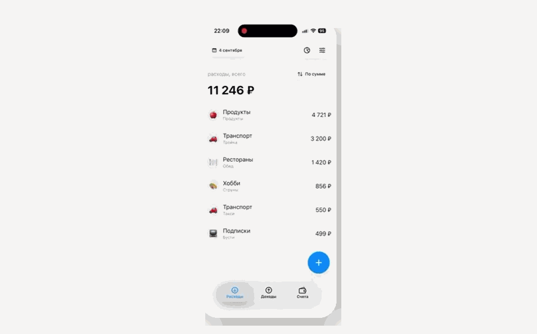

# 💸 SHMR Finance

iOS-приложение для учёта личных финансов: доходов, расходов, счетов и категорий.

Проект создан в рамках Школы мобильной разработки и дополнен офлайн-режимом, локальным хранением данных, аналитикой и защитой входа.

## Демонстрация

<p align="center">
  
</p>

## Возможности

| 💳 Операции | 📊 Аналитика | 📴 Офлайн-режим | 🔐 Безопасность |
|---|---|---|---|
| Доходы и расходы | Выбор периода | Локальное хранение | ПИН-код |
| Создание и редактирование | Фильтры и сортировка | Очередь синхронизации | Face ID и Touch ID |
| Категории и счета | Круговая диаграмма | SwiftData и Core Data | Хранение в Keychain |

## Технологии


Минимальная версия системы — iOS 18.

## Реализация

Приложение построено на MVVM с разделением интерфейса, бизнес-моделей и источников данных. Основная часть UI написана на SwiftUI, экран аналитики — на UIKit.

Доступны два режима работы:

- **Demo** — работает без API-токена и сохраняет изменения локально;
- **Live** — подключается к REST API с Bearer-аутентификацией.

В офлайн-режиме изменения сохраняются в локальную очередь и отправляются после восстановления соединения. Хранилище можно переключать между SwiftData и Core Data.

Локальные Swift Packages:

- `PieChart` — круговая диаграмма с анимацией;
- `SplashAnimation` — стартовая Lottie-анимация.

## Запуск

1. Клонируйте репозиторий.
2. Откройте `SHMR Finance.xcodeproj`.
3. Выберите схему `SHMR Finance`.
4. Запустите приложение на симуляторе или устройстве с iOS 18 или новее.

По умолчанию используется Demo-режим, дополнительная настройка не требуется.

## Подключение API

Укажите окружение в `Configuration/API.xcconfig`:

```xcconfig
APP_ENVIRONMENT = live
```

Создайте `Configuration/Secrets.xcconfig`:

```xcconfig
API_TOKEN = YOUR_API_TOKEN
```

Файл с токеном исключён из Git.

## Тесты

Unit-тестами покрыты изменение баланса, политика повторных сетевых запросов и сохранение данных Demo-режима.

Запуск через Xcode: `Product → Test`.
